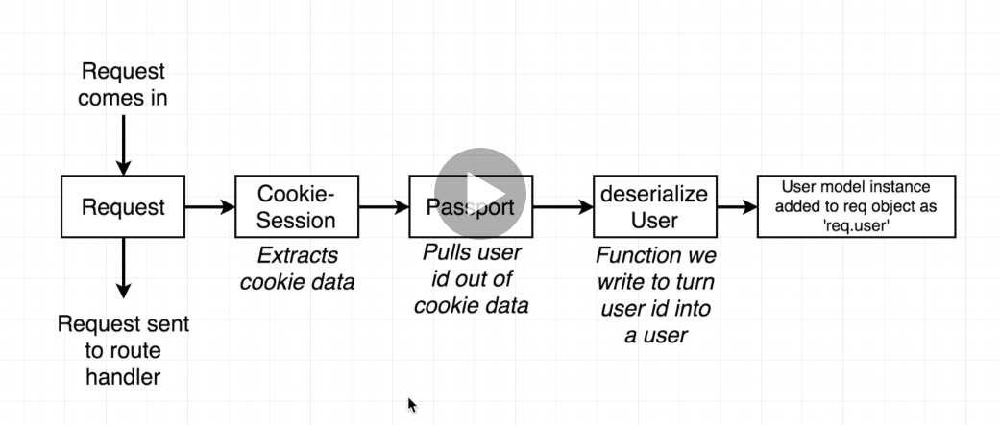

# Full Stack React

I'm taking this
[course](https://www.udemy.com/course/node-with-react-fullstack-web-development/learn/lecture/7593644#overview)
to figure out how to build banjo apps.

## Links

- Course repository: https://github.com/StephenGrider/FullstackReactCode
- Auto-formatting JS: https://github.com/prettier/prettier
- Udemy discussion thread (in video)

## Notes

### 22 October 2021

**`npm init`**

Creates a `package.json` file which is used to describe the project and manage
dependencies.

**Node**

Executes javascript outside of the browser.

**Express**

A library that runs in the Node runtime. Has helpers to manage HTTP traffic.
Express manages route handlers.

**Running the server**

The server is run with `node index.js`.

**Deployment**

Heroku, AWS, Digital Ocean, etc. Heroku is free to get started with.

- Dynamic port binding
- Node environment
- Start script
- .gitignore

_First time Deployment_

Heroku uses a git-based deployment workflow.

- App stuff:
  - live url: https://glacial-reaches-57569.herokuapp.com
  - git deployment (trigger a new deployment) https://git.heroku.com/glacial-reaches-57569.git

I just directly linked my github to heroku, so I can deploy to github. Build log
will have to be checked on heroku proper.

_Subsequent Deployments_

Just push to github. This is probably a little fragile.

**Google OAuth**


- Leverage passport (and passport strategy).
  - Passport - the main framework that runs the show.
  - Strategy - handlers for Google, Apple, Facebook, etc.

### 23 October 2021

Installing passport and Google OAuth.

Remember, passport is a framework, as well as a set of handlers: `passport` and
`passport-strategy` which handles a specific authentication service, e.g.
google, apple, facebook, spotify, linkedin...blah blah blah.

This is out of date:
`npm install --save passport passport-google -oauth20`

Instead use:
`npm install --save passport-google-oauth` which includes full backwards compatibility.

See [passport docs](http://www.passportjs.org/packages/passport-google-oauth/).

This project depends on deprecated Google+ apis for authentication, it instead neeeds google cloud.

Redirects / oauth:

```
Since the main goal of using http://localhost:5000/* was to show the redirect
error a few lectures later, we entered the correct redirect as shown above
since this is what it will be changed to anyway.
```

I finished with oauth and now have google authentication working. We also added a "dev" script to
`package.json` which uses the `nodemon` library to automatically restart our server in the case
where we want to auto-restart the server every time we edit our packages.

Project structuring is not conventionally enforced.

**Lecture 32.**

HTTP is stateless. This means that HTTP has no way to identify or share information between
requests.

We can't identify users with HTTP alone.

Here's what happens:

1. Login
2. Server recieves, and responds with identifying information (cookie, token, etc) unique to you
3. Followup requests to the server INCLUDES the token to prove who you are (I guess this is kinda
   important.
4. Followup responses include this information.

Our app will use cookie-based authentication.

### 24 October 2021

**Lecture 32**

Cookie based approach has some drawbacks considering json based webtokens, etc. There are pros and
cons to using cookies.

**Lecture 33**

Use OAuth flow to sign a user in.

1. Email / Password
   - Sign up, we keep email/pass, then user signs out, and then later, signs in again.
   - When a user signs in again, the password / email combos are compared (authenticated).
2. Pivot to OAuth
   - Sign up - get a Google Profile with token
   - Sign out
   - Sign in again, get a Google Profile with token
   - Store consistent pieces of information by comparing profile data. We have to pick a
     consistent piece of info. We'll just use the user profile id to authenticate. Google
     guarantees that the ID is invariant.
     - We place trust in Google that they will not change user-ids. This is how OAuth works.

Mongoose.js is a library we use to interact with mongo.

_MongoDB_

stores data in collections - in a MongoDB instance, you might have several collections which each
contains many records. Records are chunks of json (key-value) pairs. A defining characterisitc of
mongoDB, every record can have its own properties. MongoDB is 'schema-less', in direct contrast with
SQL / relational databasess, where every record must have the same properties.

Hierarchy:

- MongoDB instance
  - Collection
    - Records.

Mongoose

- Model Class
  - Represents a mongoDB collection
  - Model instances (javascript object representing a record)

MongoDB Atlas will be used as a free-tier service to host our database.

# 25 October 2021

We installed Mongo, and Mongoose (local handler for Mongo).

- Goal: id users and save them (and other user-records) to use.
- Use Mongoose to create a new users collection.

One design decision we can think about is when to log users into our database. In our case, we can
probably just use the google profile callback during authentication.

For mongoose stuff, we break our pattern of using require statements. This is
because when we run mongoose in testing environemnts, we may require in Models
many times. So, by avoiding this, we require in mongoose in a different way.

- Convert user record to cookie.
- Express cannot manage cookies. We need to use ANOTHER library (cookieSession) to do this.

**47 Authentication**



We're covering api routes too...interesitng.

**48 Logging Out Users**

**49 More detail**

`app.use` - modify incoming requests before they're passed off to the app. Kinda like decorators in
python. In javascript, this is called 'middleware'. Sort of also like sklearn pipeline.

_What does cookie session do_

Cookie Session
- All relevant information is in the cookie (4 kb)

Express Cookie
- Only store an id, which looks up session info from a remote store.
- Cookie session allows us to 'escape' a session store.

**50 dev vs prod keys**

- We should have two separate sets of keys - the prod keys, and the dev keys.

Why: prod keys live on prod server. Dev keys - local machine only. If someone steals your laptop,
then you want to not jeapordize your prod service.

Dev keys let us be more relaxed. Also lets us have a clean prod DB. Never manually mess around with
prod databases.

**56**

Relative paths - http vs https...ugh. Relative callbacks are critical, so GoogleStrategy has to be
invoked correctly in prod
